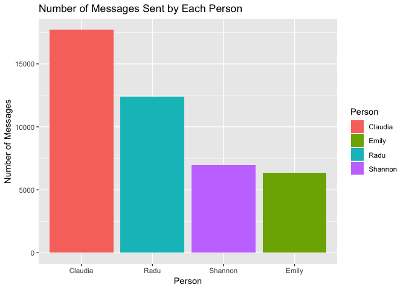
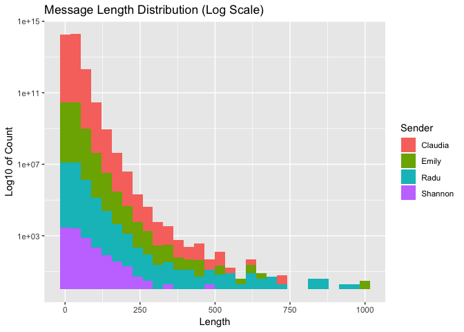
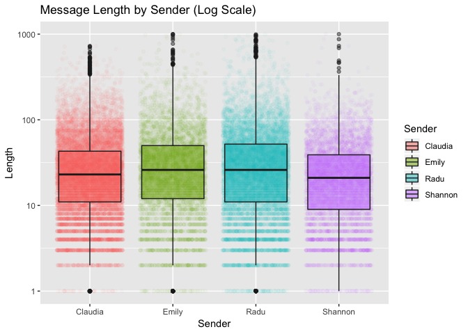
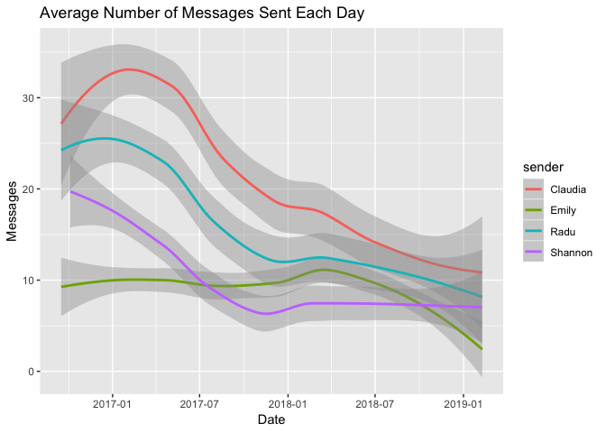
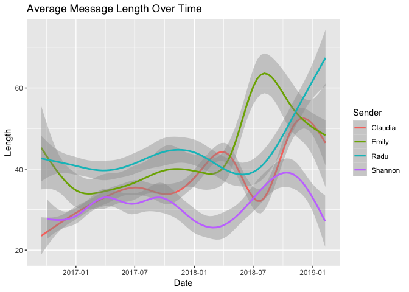

## Import Libraries


```r
library(tidyverse)
library(jsonlite)
library(naniar)
library(anytime)
```

## Import and Clean Data

First, let's import the message data from GroupMe:


```r
messages <- fromJSON("message.json")
```

Then, we select only the important data (and separate out the likes):


```r
messages <- messages %>%
    select("id", created_at, sender_id, text, favorited_by)

favs <- messages %>%
    select("id", favorited_by)
```

Now, let's add a new column with our real names, and then filter the data to remove system messages and bots:


```r
# Prettify names
messages <- messages %>%
    mutate(sender = case_when(
        sender_id == "20866009" ~ "Claudia",
        sender_id == "36155045" ~ "Radu",
        sender_id == "20291844" ~ "Emily",
        sender_id == "25843278" ~ "Shannon",
        TRUE ~ "Other"
    )) %>%
    select(created_at, sender_id, sender, text, favorited_by) %>%
    filter(sender != "Other")
```

## Messages by User

Let's look at how many messages were sent by each user:


```r
messages %>%
    group_by(sender) %>%
    summarize(count = n()) %>%
    ggplot(aes(x = reorder(sender, -count), y = count, fill = sender)) +
        geom_bar(stat = "identity") +
        labs(title = "Number of Messages Sent by Each Person",
             x = "Person", y = "Number of Messages", fill = "Person")
```

<!-- -->

## Message Length Distribution

Here's the logarithmic distribution of message lengths across all sender:


```r
messages <- messages %>%
    mutate(msg_length = str_length(text))

ggplot(messages, aes(x = msg_length, fill = sender)) +
    geom_histogram() +
    scale_y_log10() +
    labs(title = "Message Length Distribution (Log Scale)",
         y = "Log10 of Count", x = "Length", fill = "Sender")
```

```
## `stat_bin()` using `bins = 30`. Pick better value with `binwidth`.
```

```
## Warning: Removed 2202 rows containing non-finite values (stat_bin).
```

```
## Warning: Transformation introduced infinite values in continuous y-axis
```

```
## Warning: Removed 27 rows containing missing values (geom_bar).
```

<!-- -->

How about the message length by person?


```r
ggplot(messages, aes(x = sender, y = msg_length, fill = sender, color = sender)) + 
    geom_jitter(alpha = 0.03) +
    #geom_violin(color = "#222222", alpha = 0.5) + 
    geom_boxplot(color = "#222222", alpha = 0.5) +
    scale_y_log10() +
    labs(title = "Message Length by Sender (Log Scale)",
         x = "Sender", fill = "Sender", color = "Sender", y = "Length")
```

```
## Warning: Removed 2202 rows containing non-finite values (stat_boxplot).
```

```
## Warning: Removed 2202 rows containing missing values (geom_point).
```

<!-- -->

## Changes Over Time

Let's examine ways in which messages changed over time. First, we have to clean up our time values:


```r
messages <- messages %>%
    mutate(created_date = anydate(created_at))
```

Now, let's make some pretty graphs 👍

Here's the number of messages sent each week:


```r
messages %>% 
    group_by(created_date, sender) %>%
    summarize(num = n()) %>%

ggplot(aes(x = created_date, y = num, color = sender)) +
    #geom_jitter(alpha = 0.1) +
    geom_smooth() +
    #scale_y_log10() +
    labs(title = "Average Number of Messages Sent Each Day",
         x = "Date", y = "Messages")
```

```
## `geom_smooth()` using method = 'loess' and formula 'y ~ x'
```

<!-- -->

How about the way message length changed?


```r
ggplot(messages, aes(x = created_date, y = msg_length, color = sender)) +
    #geom_jitter(alpha = 0.1) +
    geom_smooth() +
    #scale_y_log10() +
    labs(title = "Average Message Length Over Time",
         x = "Date", y = "Length", color = "Sender")
```

```
## `geom_smooth()` using method = 'gam' and formula 'y ~ s(x, bs = "cs")'
```

```
## Warning: Removed 2202 rows containing non-finite values (stat_smooth).
```

<!-- -->

## Likes

Let's first clean up the likes data:

```
# Too many hours were wasted here. Screw this.


#fav_list <- messages[["favorited_by"]]

#fav_list[unlist(lapply(fav_list, function(x) identical(x, character(0))))] <- "none"


#fav_list <- lapply(fav_list, function(x) if_else(x == "none", 0, 0 + length(x)))

#for (i in 1:length(fav_list)-1) {
#    fav_list[i] = if_else(fav_list[i] == "none", 0, 0 + length(fav_list[i]))
#}


#messages %>%
#    group_by(unlist(favorited_by))
```
